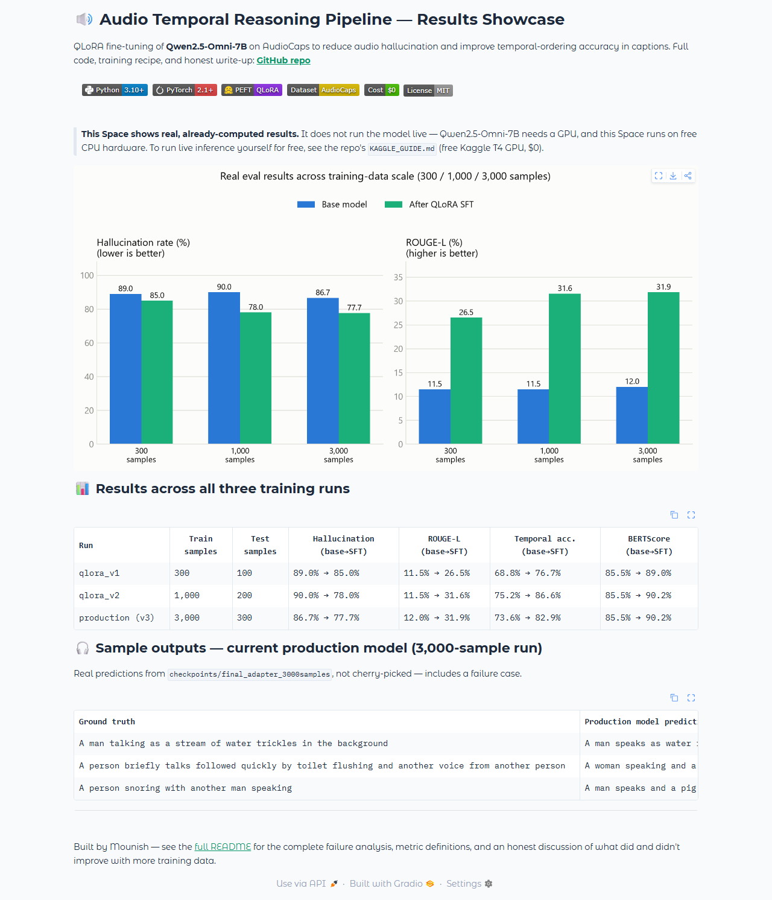
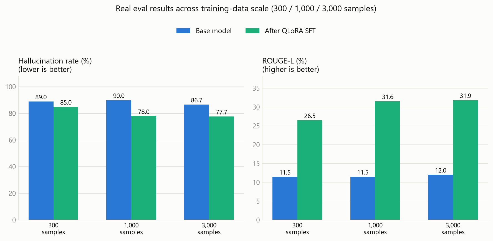

# Audio Temporal Reasoning Pipeline

> Fine-tuning **Qwen2.5-Omni-7B** with **QLoRA** to reduce audio hallucination
> and describe the temporal order of sound events — trained entirely on
> **free GPUs** (Kaggle T4).


## At a glance

| | |
|---|---|
| 🔗 **Live demo** | [Results showcase on Hugging Face Spaces](https://huggingface.co/spaces/MounishAllam/audio-temporal-reasoning-showcase) — metrics, charts, and sample outputs, no signup needed |
| 📦 **Trained weights** | [qwen2.5-omni-audio-temporal-qlora on Hugging Face](https://huggingface.co/MounishAllam/qwen2.5-omni-audio-temporal-qlora) — the production adapter (3,000-sample run), with usage instructions |
| 📊 **Training data** | AudioCaps clips (YouTube audio + human captions). Three independent scaling runs — **300 / 1,000 / 3,000** training clips — each evaluated on its own disjoint **100 / 200 / 300**-clip test set, with a train/test leakage guard enforced in code |
| 💰 **Cost** | **$0.** 4-bit QLoRA makes the 7B model trainable on a free Kaggle T4 (30 free GPU-hours/week; see [KAGGLE_GUIDE.md](KAGGLE_GUIDE.md)); the public demo runs on Hugging Face's free CPU tier |
| ✅ **Results** | Measured base-vs-fine-tuned at three data scales: hallucination rate 86.7% → 77.7%, ROUGE-L 12.0% → 31.9% (best run) — see [Results](#results) |

## Why this matters

Picture an auto-captioning system for deaf and hard-of-hearing viewers: a
clip of a quiet street should caption `[a dog barks, then a car door slams]`.
If the model **hallucinates** — inventing a sound that isn't there, or
reversing the order of events — the caption actively misleads the one person
relying on it. Audio-capable multimodal models routinely make both mistakes,
which limits their use in accessibility captioning, content moderation, and
audio analytics. This project fine-tunes an open 7B model to describe *only
what is actually there, in the order it actually happens* — cheaply enough
to run on a free GPU.

**🎬 Live demo:** [huggingface.co/spaces/MounishAllam/audio-temporal-reasoning-showcase](https://huggingface.co/spaces/MounishAllam/audio-temporal-reasoning-showcase)
— browse the results without installing anything. (The Space shows
precomputed results rather than live inference, since Qwen2.5-Omni-7B needs
a GPU the free tier doesn't have — run `app_gradio.py` locally, or follow
[KAGGLE_GUIDE.md](KAGGLE_GUIDE.md), for live inference on your own audio.)



---

## How it works

```
AudioCaps clips (YouTube audio, human captions)
        |
        v
Qwen2.5-Omni-7B loaded in 4-bit NF4 (fits a free 16 GB T4)
        |
        v
QLoRA SFT — LoRA adapter (~0.1% of weights) trained on
temporal-ordering Q&A built from AudioCaps captions;
loss computed on the answer tokens only
        |
        v
Evaluation — hallucination rate, temporal ordering accuracy,
sound event recall, ROUGE, BERTScore, latency percentiles
        |
        v
Serving — FastAPI endpoint + Gradio demo + Streamlit dashboard
```

There is also an **experimental DPO stage** (`scripts/run_dpo.py`). One
limitation to know: TRL's `DPOTrainer` here receives only text, not audio,
so it can shape caption *style* but not audio grounding. The SFT stage is
the main result; DPO is included as an exploration.

---

## Results

All numbers below come from running `Qwen/Qwen2.5-Omni-7B` on held-out
AudioCaps test clips (4-bit NF4, free Kaggle T4 GPU), before and after QLoRA SFT, at
three increasing training-data scales.

| Metric | Base model | After QLoRA SFT (2 epochs, 3,000 samples) |
|---|---|---|
| Hallucination rate ↓ | 86.7% | 77.7% |
| Temporal ordering accuracy ↑ | 73.6% | 82.9% |
| Sound event recall ↑ | 54.9% | 51.9% |
| ROUGE-1 ↑ | 14.0% | 36.3% |
| ROUGE-L ↑ | 12.0% | 31.9% |
| BERTScore F1 ↑ | 85.6% | 90.2% |
| Latency p50 / p95 (4-bit, Kaggle T4) | 3.5s / 6.8s | 1.6s / 2.0s |

SFT clearly teaches the model to answer in the requested format (ROUGE
roughly triples, and latency drops because it stops rambling) and measurably
reduces hallucination, though it doesn't come close to eliminating it — see
[Failure analysis](#failure-analysis) for why, and the scaling curve below
for how this trended as training data increased.

Test set: 300 AudioCaps test clips (streamed from `OpenSound/AudioCaps`),
with a **train/test leakage guard** — no YouTube ID that appears in the
training clips can enter the test set, enforced by an assertion in
`scripts/prepare_audiocaps_hf.py`.



*Generated by `scripts/make_results_chart.py` directly from
`outputs/benchmark_report_*.json` — re-running any eval regenerates the
chart from the underlying report files.*

### Scaling curve — does more training data help?

The same base→SFT comparison was run three times at increasing
training-data scale, each with its own disjoint test set (three independent
measurements, not the same clips re-scored):

| Train samples | Epochs | Test size | Hallucination (base → SFT) | ROUGE-L (base → SFT) | Temporal Acc. (base → SFT) | Val loss (final epoch) |
|---|---|---|---|---|---|---|
| 300 | 1 | 100 | 89.0% → 85.0% | 11.5% → 26.5% | 68.8% → 76.7% | 1.94 |
| 1,000 | 2 | 200 | 90.0% → 78.0% | 11.5% → 31.6% | 75.2% → 86.6% | 1.77 |
| 3,000 | 2 | 300 | 86.7% → 77.7% | 12.0% → 31.9% | 73.6% → 82.9% | 1.68 |

Two takeaways:

- **Diminishing returns, not a straight line.** The jump from 300→1,000
  training samples produced most of the improvement (hallucination −12pts,
  ROUGE-L +20pts); going from 1,000→3,000 barely moved the needle further
  (hallucination −0.3pts). More epochs at the larger scales would likely
  help more than more raw clips at this point.
- **Not every metric improves monotonically.** Temporal ordering accuracy
  peaked at the 1,000-sample scale (86.6%) and dipped slightly at 3,000
  (82.9%). Each row uses a different random test set, so some of this
  variation is measurement noise.

Validation loss, by contrast, decreases cleanly and monotonically with scale
(1.94 → 1.77 → 1.68) — consistent with more data helping the underlying
model fit better, even where the word-level metrics are noisier.

Full per-run metrics, training hyperparameters, and weight availability for
all three runs live in **[MODELS.md](MODELS.md)** — the model registry. The
3,000-sample run (`production`) is the published, deployable adapter.

### What the metrics actually measure (and their limits)

- **Hallucination rate** — % of predictions naming a sound event (from a
  ~130-word vocabulary of common AudioCaps sounds) that the reference never
  mentions. Catches invented sounds; misses paraphrases outside the
  vocabulary.
- **Temporal ordering accuracy** — for content words appearing in *both*
  prediction and reference, the fraction of word pairs kept in the
  reference's order. Directly measures ordering, but only over shared words.
- **Sound event recall** — % of the reference's sound events the prediction
  mentions. Complements hallucination rate (missing vs. inventing).

These are simple, auditable word-level metrics — no LLM judge. See
`evaluation/metrics.py`; each metric's design limitations are documented in
the code.

### Sample outputs — production model (3,000-sample run)

Predictions from `checkpoints/final_adapter_3000samples`
(`outputs/predictions_sft_v3.json`) — the first clean/mixed examples in file
order, shown as-is:

| Ground truth | Production model prediction | Notes |
|---|---|---|
| "A man talking as a stream of water trickles in the background" | "A man speaks as water flows in the background" | Accurate paraphrase, no invented sounds |
| "A person briefly talks followed quickly by toilet flushing and another voice from another person" | "A woman speaking and a toilet flushing" | Captures the gist; drops the second speaker |
| "A person snoring with another man speaking" | "A man speaks and a pig oinks" | Gets the speech right, mislabels the snoring as "pig oinks" — a representative remaining failure mode |

That third row shows why hallucination rate is still ~78% even after
fine-tuning — see [Failure analysis](#failure-analysis).

### Failure analysis

Predictions from the smallest (300-sample/100-test-clip) scaling run — base
vs. fine-tuned vs. ground truth. The pattern (base model rambles and invents
extra sounds; SFT gives a clean, mostly-accurate one-liner) held
consistently across all three scales.

**Where SFT clearly helps** — the base model tends to invent an extra sound
and pad its answer with chatty filler; the fine-tuned model answers in one
plain sentence with no invented events:

| Ground truth | Base prediction | SFT prediction |
|---|---|---|
| "A rocket flies by followed by a loud explosion and fire crackling as a truck engine runs idle" | "...there's a sound of a car passing by. Then, there's a whoosh sound... After that, there's a loud explosion..." (invents *car*, *whoosh*) | "A vehicle engine is running and then an explosion occurs." |
| "A man speaks as birds chirp and dogs bark" | "First, there's a **speech** from 0.00 to 4.00 seconds. Then... dogs barking and growling..." (invents fabricated timestamps) | "A man is speaking and a dog is barking." |
| "A small motor buzzing followed by a man speaking as a metal door closes" | "...there's a sound of a machine working, like a printer... a man starts speaking... something being tapped, like a pen on a table..." (invents *machine*, *tapping*) | "A man is speaking while an electric shaver is buzzing in the background." |

**Where it still gets it wrong** — when the ground truth itself is abstract
("constant rattling noise and sharp vibrations", no named source), the
fine-tuned model still invents a plausible-sounding but wrong scene:

| | |
|---|---|
| **Prompt** | "What sequence of sounds do you hear in this recording?" |
| **Ground truth** | "Constant rattling noise and sharp vibrations" |
| **Base prediction** | "First, there's a sound of a sewing machine running, then a man speaks, and finally, there's a sound of a ratchet and pawl mechanism..." |
| **SFT prediction** | "A sewing machine is running and people are talking." — still hallucinates *people talking* |

**Why**: AudioCaps captions for mechanical/ambiguous sounds are themselves
sparse and abstract, so the model has few similar training examples to learn
"just describe the buzzing, don't add people." This is a data-coverage
problem rather than a training-recipe bug — see the scaling curve above.
The most direct next experiments are more epochs at the 1,000–3,000-sample
scale, and expanding the hallucination-detection vocabulary in
`evaluation/metrics.py` to cover more sound categories.

---

## Quick start

```bash
python -m venv venv && source venv/bin/activate   # Windows: venv\Scripts\activate
pip install -r requirements.txt
python demo.py        # dry-run check, no GPU needed
pytest tests/ -v      # unit tests, no GPU needed
```

`demo.py` validates every module with mocks. Steps that need downloaded
data or a finished training run report **SKIP** (not FAIL) on a fresh clone.

## Train it — free

Follow **[KAGGLE_GUIDE.md](KAGGLE_GUIDE.md)**: a copy-paste notebook recipe
that downloads a small dataset (500 train / 100 test clips), measures the
base model, trains the QLoRA adapter, and evaluates it — all within Kaggle's
free 30 GPU-hours/week. Cost: **$0**.

The same commands work on any CUDA machine:

```bash
# 1. data (yt-dlp + ffmpeg required)
python scripts/prepare_audiocaps.py --max_train 500 --max_test 100 --max_dpo 300

# 2. baseline eval (the "before" numbers)
python scripts/run_batch_inference.py --audio_root data/audio/ \
    --test_json data/test.json --output outputs/predictions_base.json \
    --use_4bit --task temporal

# 3. QLoRA SFT
python scripts/run_finetune.py --audio_root data/audio/ \
    --data_path data/train.json --output_dir checkpoints/ \
    --num_epochs 1 --batch_size 1 --grad_accum 8 --lr 1e-4

# 4. eval the fine-tuned model (the "after" numbers)
python scripts/run_batch_inference.py --audio_root data/audio/ \
    --test_json data/test.json --output outputs/predictions_sft.json \
    --lora --lora_path checkpoints/final_adapter --use_4bit --task temporal
```

`--use_4bit` loads the model in 4-bit NF4 so everything fits in 16 GB VRAM.
On a 24 GB+ GPU you can drop it (and `--no_4bit` for training) for bf16.

**Constraints, and why QLoRA:** a free Kaggle T4 has 16 GB of VRAM — nowhere
near enough for a 7B model's ~14 GB of bf16 weights *plus* activations,
gradients, and optimizer state. 4-bit NF4 quantization shrinks the frozen
base model to ~4 GB, and only a ~0.1%-sized LoRA adapter (a few tens of MB)
is trained on top. That's what makes "$0, one Kaggle session" possible
instead of needing a rented A100.

## Demo & serving

**Gradio demo** (public share link, works from a Kaggle/Colab notebook):

```bash
python app_gradio.py --use_4bit --lora_path checkpoints/final_adapter
```

**REST API** (FastAPI):

```bash
LORA_PATH=checkpoints/final_adapter USE_4BIT=1 \
uvicorn api.main:app --host 0.0.0.0 --port 8000

curl -X POST http://localhost:8000/describe -F "file=@clip.wav"
# -> {"temporal_description": "...", "duration_sec": 9.8, "latency_ms": 2140.5}
```

Includes `/health`, file-type/size validation, and a 30-second duration cap.

**Dashboard** (metrics, predictions browser, DPO pairs):

```bash
streamlit run dashboard/app.py
```

Layout-testing data generated by `scripts/make_fake_dashboard_data.py` is
stamped `"simulated": true` and triggers a red **SIMULATED DATA** banner in
the dashboard, so it can never be confused with evaluation output.

**Docker** (the API, containerized):

```bash
docker build -t audio-temporal-reasoning .
docker run --gpus all -p 8000:8000 \
    -e LORA_PATH=checkpoints/final_adapter -e USE_4BIT=1 \
    -v $(pwd)/checkpoints:/app/checkpoints \
    audio-temporal-reasoning
```

Needs a CUDA-capable host with `nvidia-container-toolkit` — the base model
is not fast enough for CPU-only inference. See `Dockerfile`.

---

## Project structure

```
├── src/                    Core inference (model loading, chat template, generate)
├── finetune/               Dataset, collator (answer-only loss masking),
│                           QLoRA trainer, experimental DPO trainer
├── evaluation/             Metrics + benchmark runner with latency tracking
├── scripts/
│   ├── prepare_audiocaps.py        Download data (with train/test leakage guard)
│   ├── run_finetune.py             QLoRA SFT (4-bit NF4 quantization)
│   ├── run_dpo.py                  Experimental text-only DPO
│   ├── run_batch_inference.py      Eval: predictions + metrics + latency
│   ├── run_inference.py            Single-clip inference
│   ├── make_results_chart.py       Regenerates assets/scaling_curve.png from eval JSON
│   ├── deploy_hf_space.py          Pushes hf_space/ to the results-showcase Space
│   ├── deploy_hf_model.py          Publishes the production adapter to the HF model repo
│   ├── screenshot_hf_space.py      Regenerates assets/space_interface.png
│   └── make_fake_dashboard_data.py Layout-testing data for the dashboard only
├── models/                 Model registry (qlora_v1, qlora_v2, production) — see MODELS.md
├── hf_space/               Source for the Hugging Face results-showcase Space
├── assets/                 Generated chart + screenshot embedded in this README
├── api/main.py             FastAPI serving endpoint
├── app_gradio.py           Gradio demo (share link)
├── dashboard/app.py        Streamlit dashboard
├── tests/                  Unit tests (mocked, no GPU)
├── configs/                Documented hyperparameter defaults
├── Dockerfile              Container for the FastAPI serving layer
├── KAGGLE_GUIDE.md         Free training recipe (start here)
├── MODELS.md               Model registry: all three runs, deployment policy, known caveats
└── demo.py                 Dry-run validator
```

## Roadmap

**Toward production latency.** Current p95 on a free Kaggle T4 in 4-bit is
~2 s per clip. To get under 1 s: merge the adapter and quantize with
AWQ/GPTQ for faster kernels, cap `max_new_tokens` (captions rarely need
256), batch concurrent requests, and serve with vLLM once it supports
Omni-style audio inputs.

**Toward better model quality**, ranked by expected payoff vs. effort based
on what the three scaling runs revealed:

1. **Promote the best-validation checkpoint.** The trainer already computes
   and saves `checkpoints/checkpoint-best`; promoting it (instead of the
   last-epoch state) as the final adapter is a one-line change and the
   cheapest likely improvement, since all three runs showed val loss
   ticking up between epoch 1 and the final epoch.
2. **Reduce overfitting directly** — raise `lora_dropout` above the current
   0.05, or lower the learning rate, so late-epoch validation loss stops
   climbing. Cheap to try (one flag), needs a re-run to confirm.
3. **More epochs, not more raw clips.** Data scale gave diminishing
   returns — hallucination rate dropped 12 points going from 300→1,000
   training samples but only 0.3 points from 1,000→3,000. More epochs at
   the existing 1,000–3,000-sample scale (combined with #2) is a more
   promising lever than gathering more clips.
4. **Address the precision/recall trade-off.** Fine-tuning made the model
   more conservative — hallucination rate dropped, but sound event recall
   didn't improve monotonically (51%→55%→52% across scales). Worth checking
   whether the training data's one-plain-sentence style teaches the model
   to omit true sounds along with invented ones.
5. **Expand the hallucination-detection vocabulary**
   (`evaluation/metrics.py`, ~130 words currently) so the metric covers
   more sound categories on both sides — missed inventions and missed
   correct mentions are currently undercounted equally.
6. **DPO stays experimental, deliberately.** It's text-only, so it can
   shape caption *style* but can't teach audio grounding — not worth
   further investment without an audio-aware preference-pair source.

## Skills demonstrated

| Skill | Where |
|---|---|
| Multimodal LLM inference (audio + text) | `src/` |
| QLoRA: 4-bit NF4 + LoRA + grad checkpointing | `scripts/run_finetune.py` |
| Answer-only loss masking for chat fine-tuning | `finetune/collator.py` |
| Auditable evaluation metric design | `evaluation/metrics.py` |
| Data pipeline with leakage guard | `scripts/prepare_audiocaps.py` |
| Serving: REST API with validation + demo UI | `api/`, `app_gradio.py` |
| Containerized deployment | `Dockerfile` |
| Working within free-tier GPU constraints | `KAGGLE_GUIDE.md` |

## Tech stack

Qwen2.5-Omni-7B (Apache 2.0) · transformers ≥ 4.52 · PEFT/QLoRA ·
bitsandbytes 4-bit NF4 · TRL (experimental DPO) · librosa/soundfile ·
AudioCaps (`d0rj/audiocaps`) · FastAPI · Gradio · Streamlit · pytest

## License

MIT — free to use, modify, and distribute.

---

*Built by Mounish — multimodal AI engineering portfolio project.*
